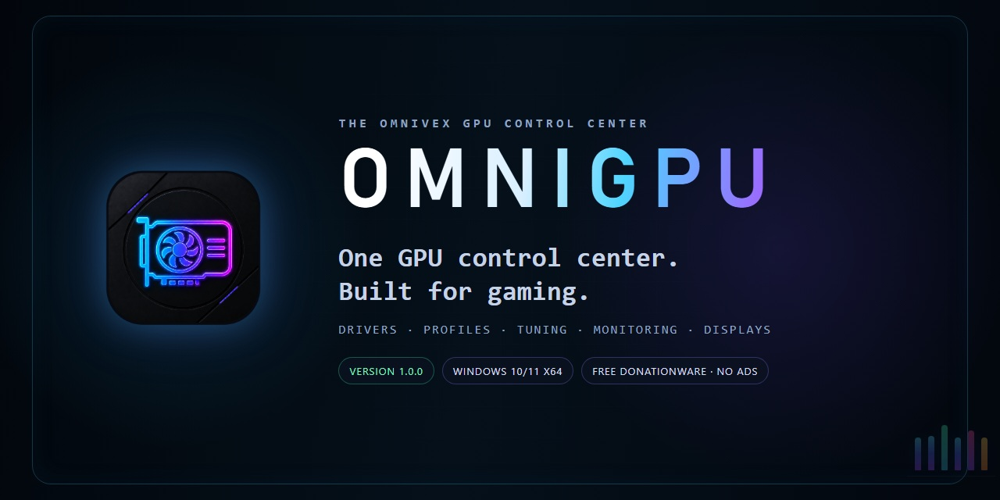
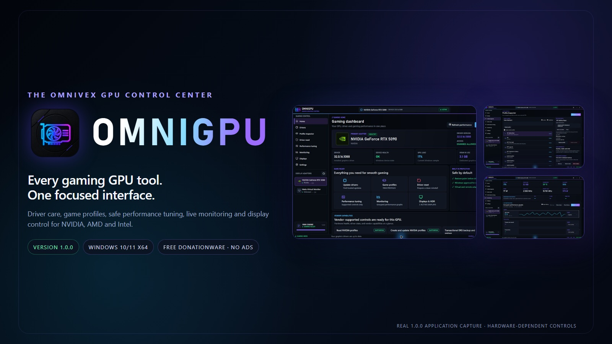
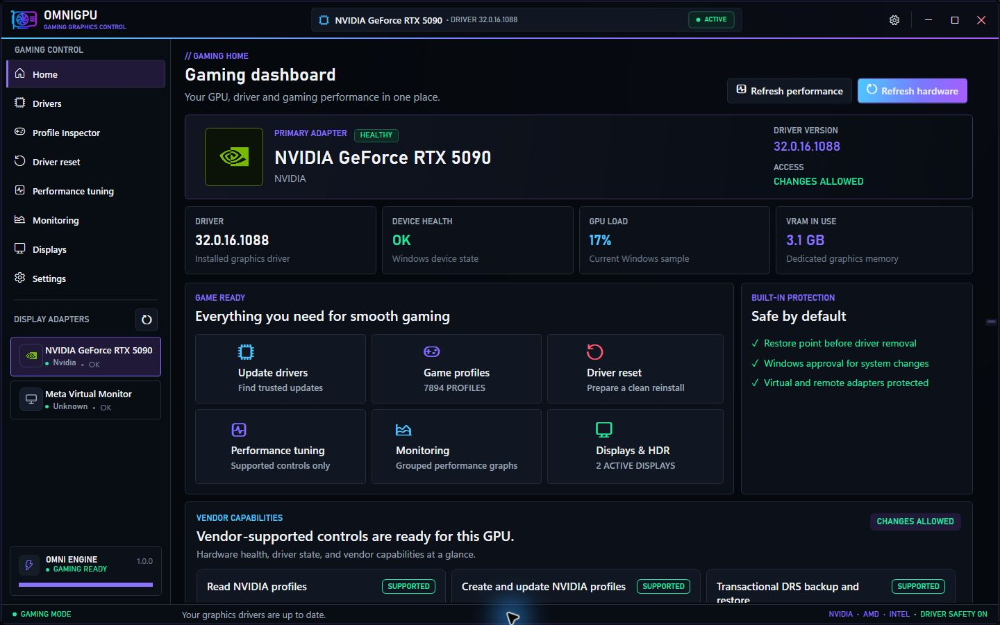
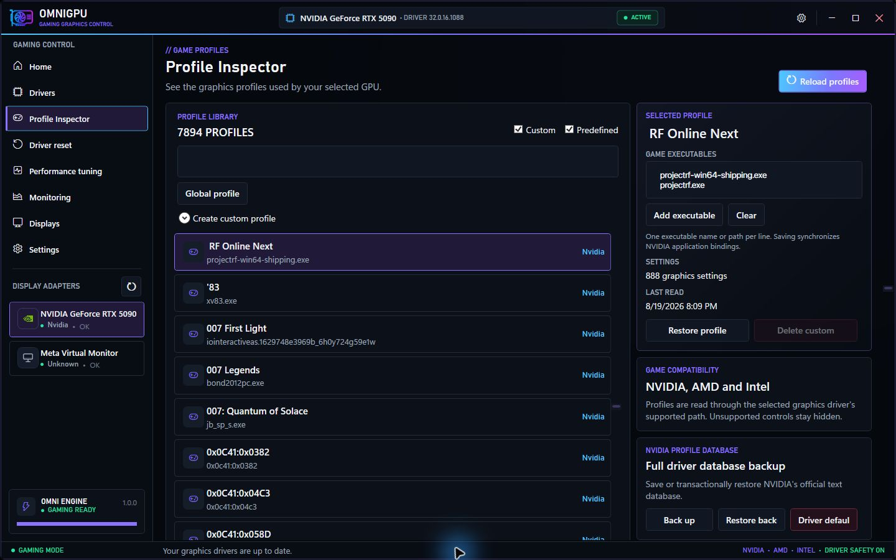
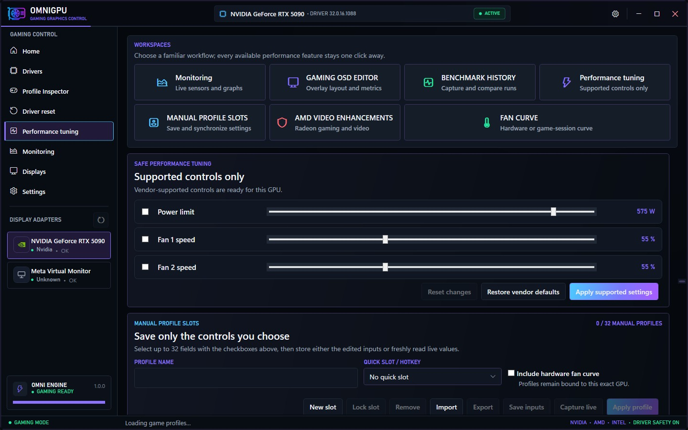
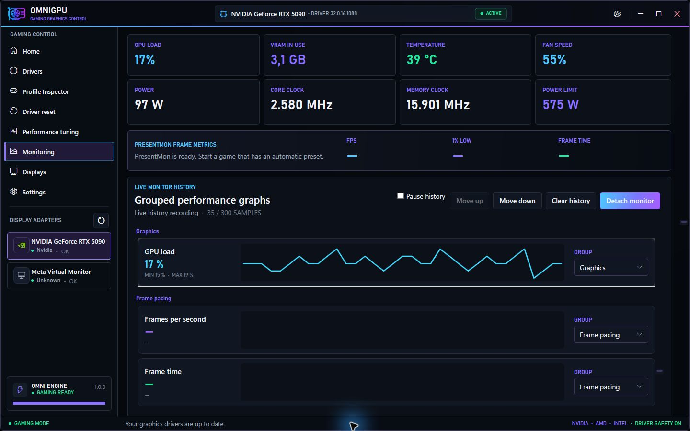
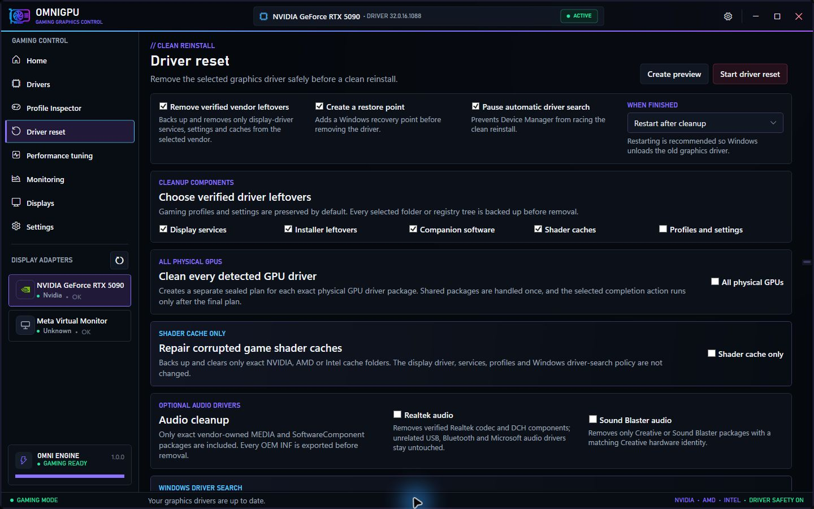
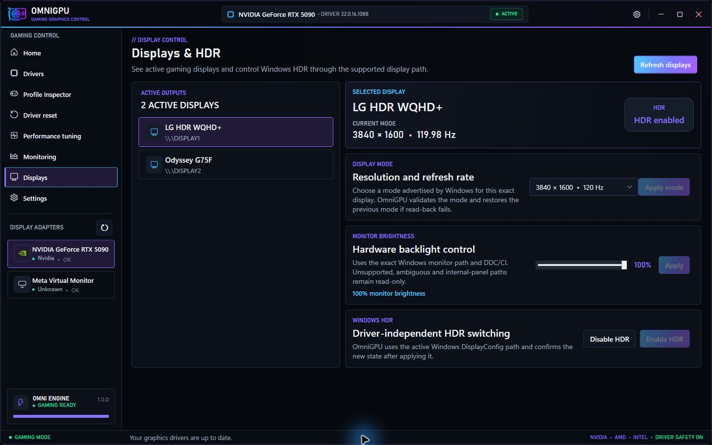

  

<h1 align="center">OmniGPU</h1>

  <strong>Every gaming GPU tool. One focused interface.</strong> 
  Driver care, profiles, capability-gated tuning, monitoring and display control for NVIDIA, AMD and Intel.

  
  
  
  
  
  

  
  &nbsp;&nbsp;
  

<!-- Quick navigation. The accent chip introduces the product; the remaining
     chips jump to the most useful public sections and documents. -->

  
  
  
  
  
  
  
  

---

## One control center, built around games

OmniGPU brings the workflows normally spread across driver cleanup tools, NVIDIA profile editors, AMD tuning utilities, Windows Driver Store management and overclocking dashboards into one restrained OmniVex interface.

It detects the exact physical adapter first, then exposes only the controls reported by the installed official vendor runtime. Unsupported, ambiguous, virtual, remote and protected adapters remain unavailable for mutation instead of receiving guessed settings.

> **This is a documentation and media repository.** It intentionally contains no OmniGPU source code, application binary, installer or direct download. Use only the destinations in [Official links](LINKS.md); mirrors and repacks are unofficial.

## What OmniGPU brings together

| Area | What you get |
|---|---|
| **Driver care** | Exact-adapter discovery, reviewed Windows-serviced driver installation, known-good package vault and rollback-aware maintenance |
| **Driver reset** | A DDU-style clean-reset plan with restore point, backup, Safe Mode guidance, exact residual cleanup and restart/shutdown/manual completion |
| **Driver Store** | Online/offline package inventory, smart cleanup selection, add/install/remove/export and guarded force removal in an advanced workspace |
| **Profile Inspector** | NVIDIA DRS profiles, applications, friendly and raw values, favorites, search, purpose categories, defaults, `.nip` exchange and verified history |
| **Performance tuning** | Driver-reported NVIDIA, AMD and Intel clock, voltage, power, thermal and fan controls protected by an explicit session-only OC mode |
| **Monitoring & OSD** | Live telemetry, PresentMon FPS/1% low/frametime, graphs, CSV logging, benchmarks, screenshots and configurable in-game overlays |
| **Game automation** | Per-game performance and fan presets with apply, exit restore, interrupted-session recovery and lightweight background detection |
| **Displays & latency** | Resolution/refresh, HDR, exact-output DDC/CI brightness, standby-memory cleanup and timer-resolution controls |

The [complete feature list](FEATURES.md) documents the full surface and its capability boundaries.

## Real application captures

  

| Gaming dashboard | Profile Inspector |
|---|---|
|  |  |

| Performance tuning | Live monitoring |
|---|---|
|  |  |

| Safe driver reset | Displays and HDR |
|---|---|
|  |  |

These are real 1.0.0 application captures. Hardware-specific values and controls vary by GPU, driver, firmware, display and OEM policy.

## Safety is part of the feature set

- The normal interface runs without elevation; privileged mutations use a separate one-shot UAC broker.
- Every hardware write is bound to the selected PCI adapter, current driver and a short-lived explicit authorization.
- Driver cleanup, tuning, profile and display workflows use preview, confirmation, backup/read-back and rollback contracts.
- Unknown and unsupported states fail closed rather than falling back to generic clocks, voltages, paths or device guesses.
- OmniGPU has no automatic application updater, silent installer, advertising SDK or usage analytics service.

GPU tuning and driver removal can still cause instability, display loss, restart requirements or data loss. Keep important work backed up and use conservative settings.

## Donationware, without a paywall

OmniGPU is donationware: free to use, with no required payment, no advertisements and no paid feature tier. If it saves you time, an optional Ko-fi or Patreon contribution helps fund hardware validation, compatibility work and continued development.

| Ko-fi | Patreon |
|---|---|
| [Support on Ko-fi](https://ko-fi.com/theomnigrid) | [Support on Patreon](https://www.patreon.com/TheOmniGrid) |

Donating does not grant source-code, redistribution, resale or trademark rights. Please send other users to the official project page instead of sharing an installer or creating a mirror. Read the [donationware policy](DONATIONWARE.md) and [public materials notice](LICENSE.md).

## Current verified state

- Product version: **1.0.0**—intentionally pinned
- Platform: Windows 10/11 x64; self-contained runtime
- Automated contracts: **360/360 passing** in Debug and Release with zero managed build warnings
- Localization: **1,836 synchronized non-empty strings** in English, Deutsch, Español, Français and Română
- Live read-only validation: NVIDIA GeForce RTX 5090 plus current NVML/NVAPI and installed PresentMon paths
- Release boundary: production Authenticode signing and the documented real-hardware write/read-back matrices remain required before the build is represented as a universally certified release candidate

See [Release status](STATUS.md), [Compatibility](COMPATIBILITY.md) and the [public roadmap](ROADMAP.md) for the honest boundary between implemented software and external certification.

## Documentation

| Read | Purpose |
|---|---|
| [Features](FEATURES.md) | Full categorized feature inventory |
| [Compatibility](COMPATIBILITY.md) | Windows, GPU, display and optional-runtime requirements |
| [FAQ](FAQ.md) | Direct answers about vendors, profiles, cleanup, tuning and updates |
| [Security](SECURITY.md) | Privilege boundary and private vulnerability reporting |
| [Privacy](PRIVACY.md) | Local data, network use and diagnostics policy |
| [Support](SUPPORT.md) | What to include in a useful report |
| [Changelog](CHANGELOG.md) | Maintained 1.0.0 development history |
| [Credits](CREDITS.md) | Independent implementations, research references and attribution |

## Independent software

OmniGPU is independent software by OmniVex. NVIDIA, AMD, Intel, Microsoft, MSI and the referenced community projects do not sponsor or endorse it. Their names identify compatible hardware, software or researched workflows only.

  <strong>Tuned for framerate, mixed for headroom, sharp to the pixel.</strong> 
  <a href="https://github.com/TheOmniGrid">Explore The OmniGrid</a> ·
  <a href="mailto:omnivex@theomnigrid.biz">omnivex@theomnigrid.biz</a>

